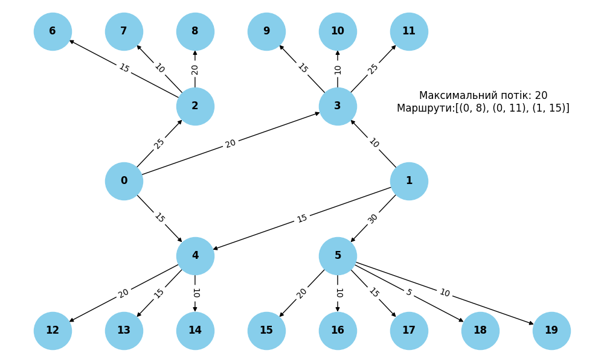

## Завдання 1. Застосування алгоритму максимального потоку для логістики товарів

Отримано наступний результат:
1. Максимальний потік дорівнює 20
2. Максимальній потік реалізується з Терміналу 1 (вузел 0) до магазинів 3 (вузел 8) та 6 (вузел 11), та з Терміналу 2 (вузел 1) до магазину 10 (вузел 15)

Таблиця з результатами потоків між терміналами та магазинами:

Термінал   | Магазин    | Фактичний Потік (одиниць)
-----------+------------+--------------------------
Термінал 1 | Магазин 1  | 15
Термінал 1 | Магазин 2  | 10
Термінал 1 | Магазин 3  | 20
Термінал 1 | Магазин 4  | 15
Термінал 1 | Магазин 5  | 10
Термінал 1 | Магазин 6  | 20
Термінал 1 | Магазин 7  | 15
Термінал 1 | Магазин 8  | 15
Термінал 1 | Магазин 9  | 10
Термінал 1 | Магазин 10 | 0
Термінал 1 | Магазин 11 | 0
Термінал 1 | Магазин 12 | 0
Термінал 1 | Магазин 13 | 0
Термінал 1 | Магазин 14 | 0
Термінал 2 | Магазин 1  | 0
Термінал 2 | Магазин 2  | 0
Термінал 2 | Магазин 3  | 0
Термінал 2 | Магазин 4  | 10
Термінал 2 | Магазин 5  | 10
Термінал 2 | Магазин 6  | 10
Термінал 2 | Магазин 7  | 15
Термінал 2 | Магазин 8  | 15
Термінал 2 | Магазин 9  | 10
Термінал 2 | Магазин 10 | 20
Термінал 2 | Магазин 11 | 10
Термінал 2 | Магазин 12 | 15
Термінал 2 | Магазин 13 | 5
Термінал 2 | Магазин 14 | 10

